# ☕ Ritual Roast Coffee - AWS Fargate Deployment Project
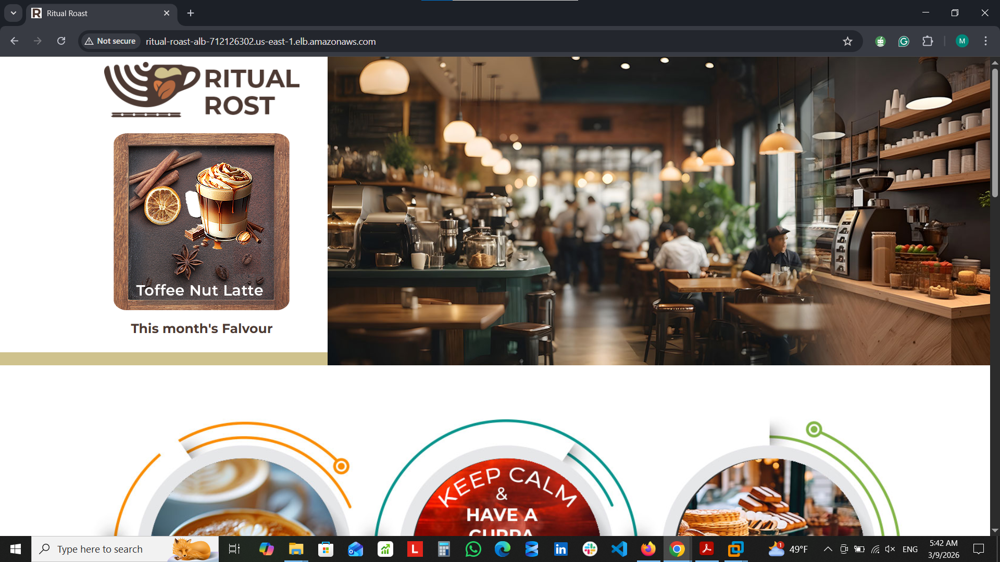

## 📋 Project Overview
This project demonstrates my ability to deploy a **production-ready containerized application** on **AWS ECS Fargate**. I built the complete infrastructure, deployed the application, and then responsibly **destroyed all resources** to avoid ongoing costs.

## 🏗️ Architecture Diagram
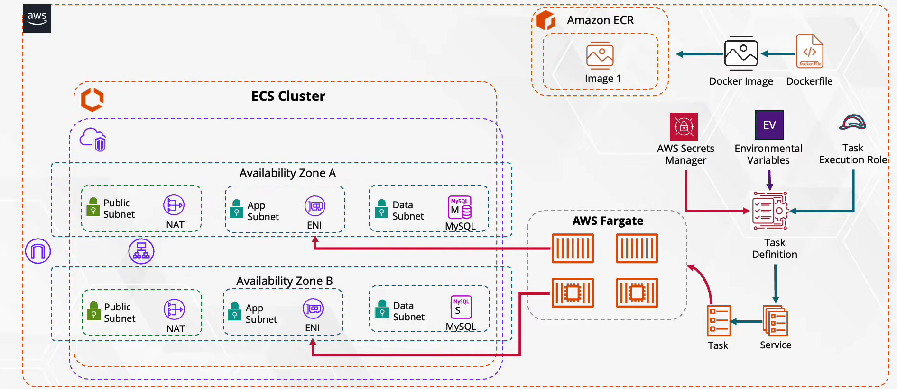
The diagram above shows all the AWS components I built for this project.

## ⚙️ AWS Infrastructure Components
### 🌐 Networking Layer
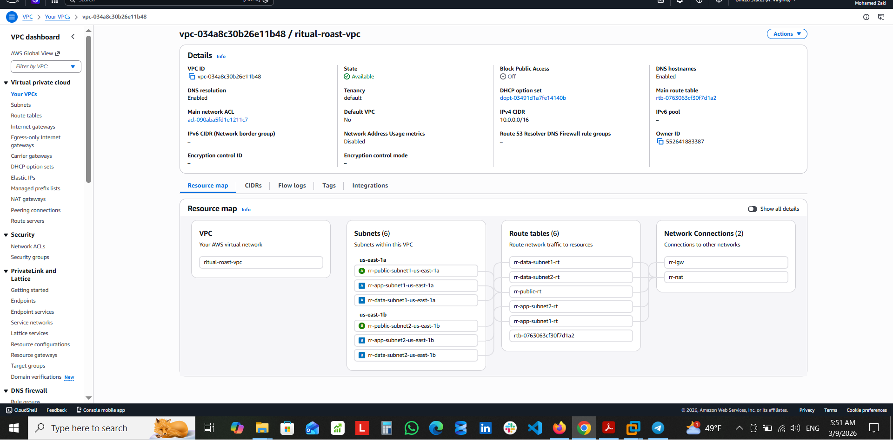

I created a highly available network architecture:
- **VPC**: 10.0.0.0/16 spanning 2 Availability Zones
- **2 Public Subnets**: For ALB and NAT Gateway (internet-facing)
- **2 App Private Subnets**: For ECS Fargate tasks (isolated)
- **2 Data Private Subnets**: For RDS database (extra isolation)

### 🔄 Internet Access
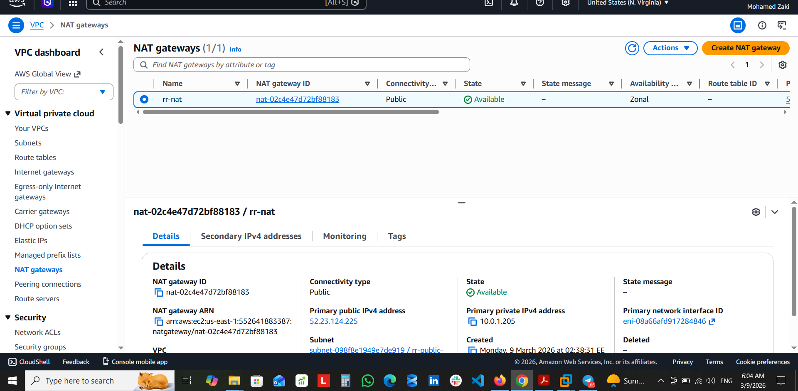
- **NAT Gateway** in public subnets enables private ECS tasks to access internet for updates
- **Internet Gateway** for public resources (ALB)

### 🗄️ Database Layer
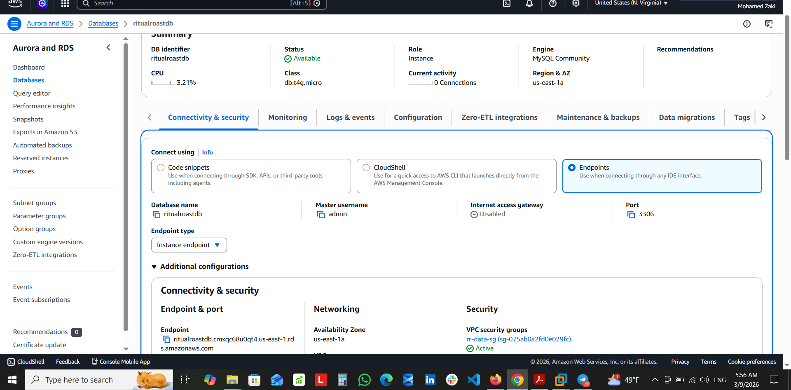
- **Amazon RDS MySQL** in private data subnets
- Multi-AZ for high availability
- Security groups restrict access to only ECS tasks

### 📦 Container Registry
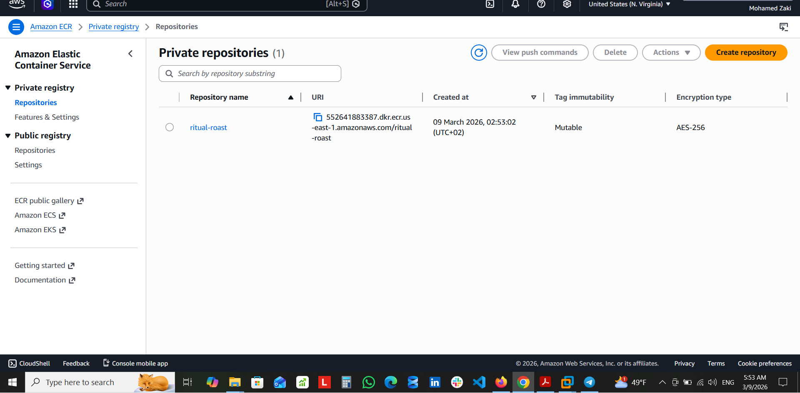
- **Amazon ECR** repository storing the Ritual Roast Coffee Docker image
- Image pushed and ready for ECS deployment

### 🔐 Security & Secrets Management
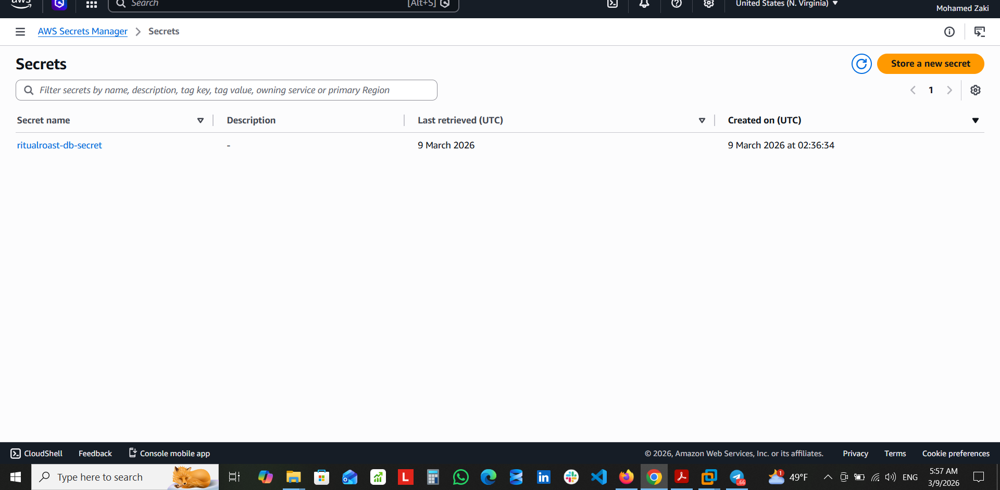

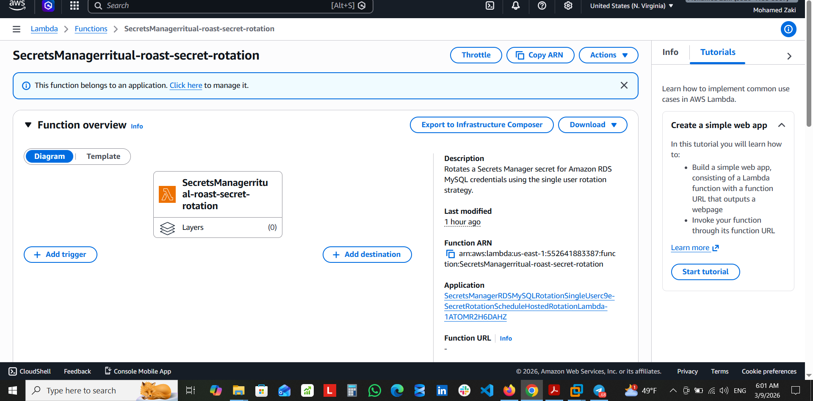
- **AWS Secrets Manager** securely stores database credentials
- **Lambda function** for automated credential rotation (every 30 days)
- No hardcoded secrets in application code

### ⚖️ Load Balancing
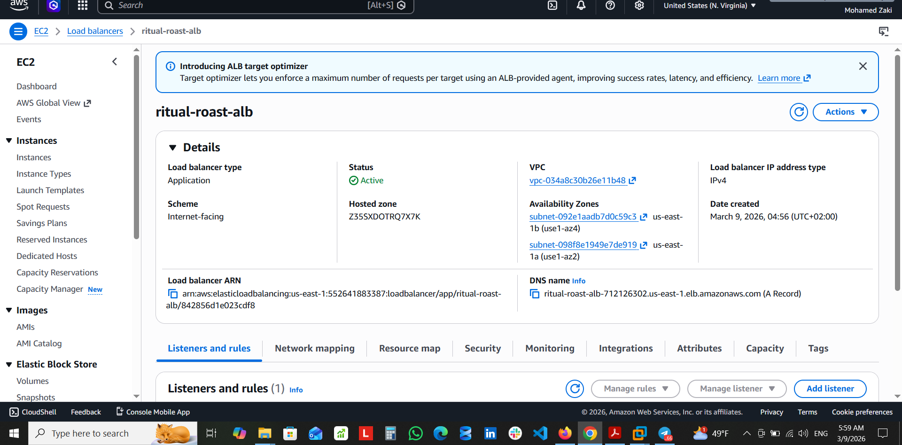
- **Application Load Balancer** (internet-facing) in public subnets
- **Target Group** on port 80 with health checks
- All ECS tasks registered and healthy

### 🚀 Container Orchestration (ECS Fargate)
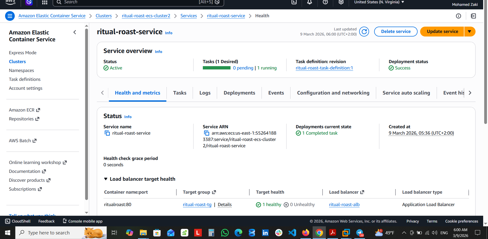
- **ECS Cluster** grouping all container resources
- **Task Definition** with:
  - ***Fargate*** launch type (serverless)
  - 0.5 vCPU, 1GB memory
  - Container image from ECR
  - Secrets Manager integration
- **ECS Service** maintaining 1 running task
- Service integrated with ALB target group  
### ✅ Successful Deployment

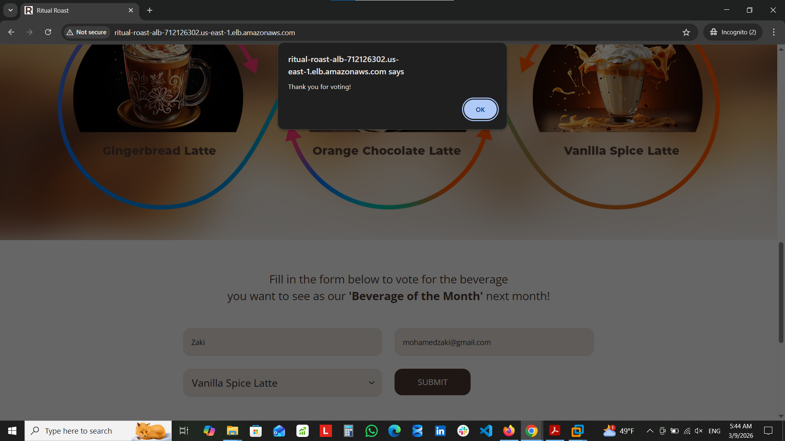

## 🧠 What I Learned & Demonstrated
| Skill | How I Demonstrated It |
|-------|----------------------|
| **VPC Design** | Created multi-AZ network with public/private subnets |
| **Security** | Implemented Secrets Manager + Lambda rotation |
| **Containerization** | Deployed Docker containers on Fargate |
| **High Availability** | Multi-AZ for both compute and database |
| **Cost Optimization** | Destroyed all resources after completion |
| **Troubleshooting** | Ensured all health checks passed |

## 📬 Contact
- **GitHub**: [@Mohamedzaakii](https://github.com/Mohamedzaakii)
- **LinkedIn**: [mohamed-zaaki](https://linkedin.com/in/mohamed-zaaki)

